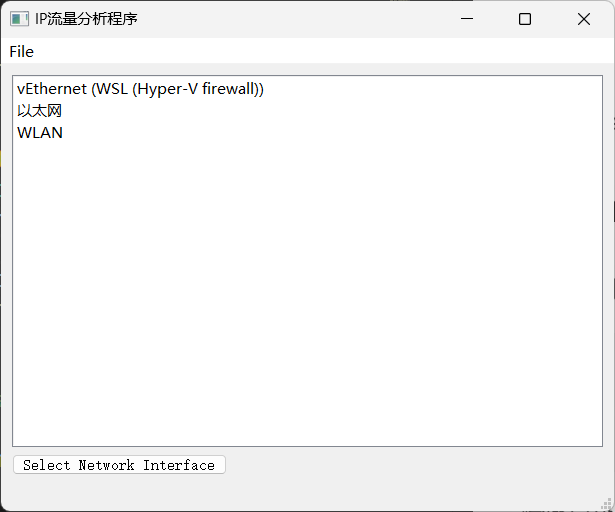
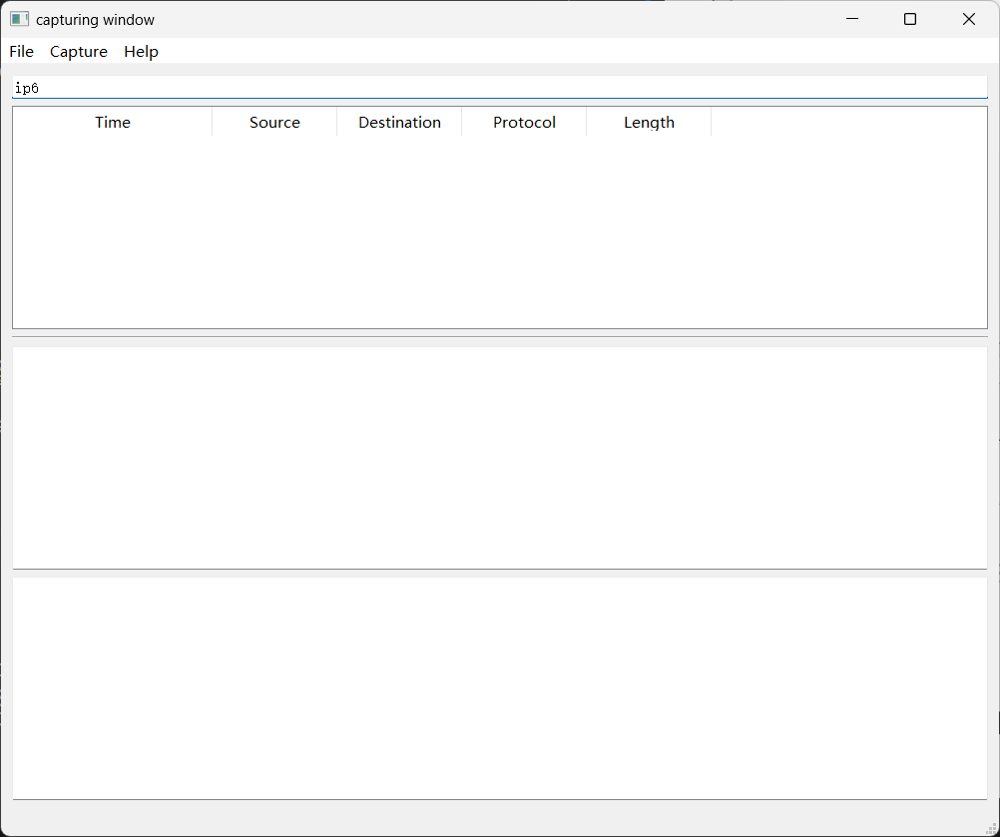
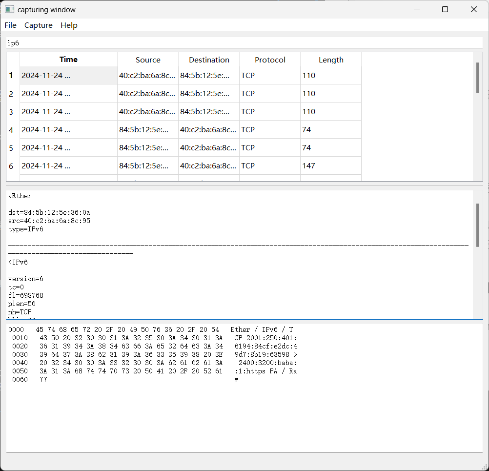

# IP流量分析程序

Network course project
python-packet-sniffer
NKU计算机网络作业IP流量分析程序

## Introduction

Windows 平台，基于 `Npcap` API 抓包。

## Installation

需要使用安装 `requirements.txt` 中的依赖

```bash
conda create -n sniffer python=3.10
conda activate sniffer
pip install -r requirements.txt
```

除此以外，对于 Windows 平台，需要安装一下两种抓包工具的其中任何一种：

- Winpcap
- Npcap

由于 WinPcap 项目已停止开发，建议安装[Npcap](https://npcap.com/#download).

## Running

主文件夹下有 Startwindow.py 可以直接执行命令：

```bash
python Startwindow.py
```

## 运行说明

软件启动后如下图所示



- 软件会自动检测能够抓包的网卡设备，并在输出框上显示，注意本地连接的网线(网线插电脑上)无法被检测到。
- 点击 `WLAN` (推荐)，选择 `Select Network Interface` 进入二级页面。



- File: 文件系统
  - Open: 打开捕获到包的文件
  - Save: 保存捕获到的包
- Capture: 捕获操作
  - Start: 开始捕获
  - Stop: 停止捕获
  - Clear: 清空包列表
- Filter: 用于输入 `BPF` 表达式以过滤软件包。默认模式为 `ip6` 仅捕获IPv6分组。
- 输出框1: 是包列表
- 输出框2: 包的详细信息
- 输出框3: 包的具体二进制信息

使用Capture抓包之前应先设置好Filter。仿照[Sniffer](https://github.com/StevenBaby/sniffer)的设置，Filter 在设置完后会进行校验，检测通过之后，Filter 输入框背景颜色会变成`Green`，否则会变成`Red`。若Filter设置错误，点击Capture-Start软件将会没有反应。此时应先点击Capture-Stop，设置好Filter，再进行抓包。
注：如想一直嗅探IPv6分组，应确保 Filter 中含有 `ip6` 条件。



抓包完成后，可以在列表中点击任何一个包查看详细信息，如上图所示。

## Acknowledgement

This repository was built on top of [python-packet-sniffer](https://github.com/OmarBarakat1995/python-packet-sniffer) and [Sniffer](https://github.com/StevenBaby/sniffer). I thank the effort from our community.
